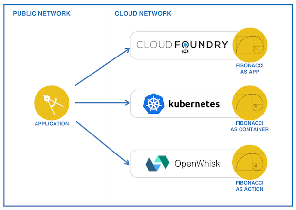

# Fibonacci-Microservice-on-Bluemix-Cloud
Creation and deployment of Sample Fibonacci Microservice on Bluemix Cloud.[(Original)](https://github.com/IBM-Cloud/multiple-deployment-options)

This project gets deployed:

* as a [Cloud Foundry](https://www.cloudfoundry.org/) application,
* as a container in a [Kubernetes cluster](https://kubernetes.io/),
* and as an [OpenWhisk](http://openwhisk.org/) action.

   <center>
      
   </center>

## Requirements

* An IBM Bluemix account. Either [sign up][bluemix_signup_url], or use an existing account.
* [Bluemix CLI](https://clis.ng.bluemix.net/ui/home.html)
* [OpenWhisk CLI](https://console.ng.bluemix.net/openwhisk/learn/cli)
* [Bluemix Container Registry plugin](https://console.ng.bluemix.net/docs/cli/plugins/registry/index.html)
* [Bluemix Container Service plugin](https://console.ng.bluemix.net/docs/containers/cs_cli_devtools.html)
* [Node.js](https://nodejs.org), version 6.9.1 (or later)
* [Kubernetes CLI (kubectl)](https://kubernetes.io/docs/tasks/kubectl/install/) version 1.5.3 (or later)
* [Docker CLI](https://docs.docker.com/engine/installation/) version 1.9 (or later)

## About the micro-service

The micro-service used in this project computes Fibonacci numbers.

From [Wikipedia](https://en.wikipedia.org/wiki/Fibonacci_number): *In mathematics, the Fibonacci numbers are the numbers in the following integer sequence, called the Fibonacci sequence, and characterized by the fact that every number after the first two is the sum of the two preceding ones:*

  ```
  0, 1, 1, 2, 3, 5, 8, 13, 21, 34, 55, 89, 144, ...
  ```

The implementation of the Fibonacci sequence is done in **[service/lib/fibonacci.js](service/lib/fibonacci.js)**. The same implementation is used across all deployment options.

## Service API

Once deployed, the service implements 3 API calls:
* compute the Fibonacci number after *n* iterations,
* let the computation run for *t* milliseconds,
* and simulate a crash of the service.

Depending on which compute option you are using, use the following cURL calls:

| Endpoint Type | Endpoint  | URL                                      |
| ------------- | --------- | ---------------------------------------- |
| Cloud Foundry | iteration | `curl -v http://fibonacci-service-<random-string>.mybluemix.net/fibonacci?iteration=1000` |
|               | duration  | `curl -v http://fibonacci-service-<random-string>.mybluemix.net/fibonacci?duration=5000` |
|               | crash     | `curl -v -X POST http://fibonacci-service-<random-string>.mybluemix.net/fibonacci?crash=true` |
| Kubernetes    | iteration | `curl -v http://<cluster-ip>:30080/fibonacci?iteration=1000` |
|               | duration  | `curl -v http://<cluster-ip>:30080/fibonacci?duration=5000` |
|               | crash     | `curl -v -X POST http://<cluster-ip>:30080/fibonacci?crash=true` |
| OpenWhisk     | iteration | `curl -v https://openwhisk.ng.bluemix.net/api/v1/web/<namespace>/default/fibonacci?iteration=1000` |
|               | duration  | `curl -v https://openwhisk.ng.bluemix.net/api/v1/web/<namespace>/default/fibonacci?duration=5000` |
|               | crash     | `curl -v -X POST https://openwhisk.ng.bluemix.net/api/v1/web/<namespace>/default/fibonacci?crash=true` |

## Code Structure

### Cloud Foundry application

| File                                     | Description                              |
| ---------------------------------------- | ---------------------------------------- |
| [app.js](service/app.js)                 | Main application, start the express web server and expose the service API |
| [lib/fibonacci.js](service/lib/fibonacci.js) | The implementation of the Fibonacci sequence, shared by all deployment options |
| [package.json](service/package.json)     | List the packages required by the application |
| [manifest.yml](service/manifest.yml)     | Description of the application to be deployed |
| [.cfignore](service/.cfignore)           | List files to ignore when deploying the application to Cloud Foundry |

### Kubernetes deployment

| File                                     | Description                              |
| ---------------------------------------- | ---------------------------------------- |
| [app.js](service/app.js)                 | Main application, start the express web server and expose the service API |
| [lib/fibonacci.js](service/lib/fibonacci.js) | The implementation of the Fibonacci sequence, shared by all deployment options |
| [package.json](service/package.json)     | List the packages required by the application |
| [Dockerfile](service/Dockerfile)         | Description of the Docker image          |
| [fibonacci-deployment.yml](service/fibonacci-deployment.yml) | Specification file for the deployment of the service in Kubernetes |

### OpenWhisk action

The OpenWhisk action is deployed as a [zip action](https://console.ng.bluemix.net/docs/openwhisk/openwhisk_actions.html#openwhisk_create_action_js) where several files are packaged into a zip file and the zip file is passed to OpenWhisk as the implementation for the action. **[deploy.js](service/deploy.js)** takes care of packaging the zip file.

| File                                     | Description                              |
| ---------------------------------------- | ---------------------------------------- |
| [handler.js](service/action/handler.js)  | Implementation of the OpenWhisk action   |
| [lib/fibonacci.js](service/lib/fibonacci.js) | The implementation of the Fibonacci sequence, shared by all deployment options |
| [package.json](service/action/package.json) | Specify the action entry point (handler.js) |
| [deploy.js](service/deploy.js)           | Helper to deploy and undeploy the OpenWhisk action |

### Tester web app

Under the `tester` directory is a simple web application to register and test the deployed micro-services. It can be pushed to Bluemix with `cf push` or simply executed locally with `python -m SimpleHTTPServer 28080` as example.

## Troubleshooting

### Cloud Foundry

  Use
  ```
  cf logs fibonacci-service
  ```
  to look at the live logs for the web application.

### Kubernetes

  Use
  ```
  kubectl proxy
  ```
  and look at the status of the resources in the console.

### OpenWhisk

  Use
  ```
  wsk activation poll
  ```
  and perform an invocation of the action.

## Get the code

* Clone the app to your local environment from your terminal using the following command:

   ```
   git clone https://github.com/arpitjainds/Fibonacci-Microservice-on-Bluemix-Cloud.git
   ```

## Deploy the service as a Cloud Foundry application

1. Change to the **service** directory.

   ```
   cd multiple-deployment-options/service
   ```

1. Push the application

   ```
   bx cf push
   ```

1. After a short while, the application is available on a random route. The route name can either be retrieved from the Cloud Foundry deployment log messages or with using the command `cf routes`.

### Test the Cloud Foundry application

To compute the Fibonacci number after *n* iterations, use the `iteration` parameter of the API:

   ```
   curl -v http://fibonacci-service-<random-string>.mybluemix.net/fibonacci?iteration=1000
   ```

To let the computation run for *t* milliseconds, use the `duration` parameter:

   ```
   curl -v http://fibonacci-service-<random-string>.mybluemix.net/fibonacci?duration=5000
   ```

To simulate a crash of the service, use the API with the `crash` parameter:

   ```
   curl -v -X POST http://fibonacci-service-<random-string>.mybluemix.net/fibonacci?crash=true
   ```

This last call will exit the node.js application, simulating an error of the API.

## Deploy the service as a container in Kubernetes

### Build the Docker image

1. Start the Docker engine on your local computer

   > See the [Docker installation instructions](https://docs.docker.com/engine/installation/) if you don't yet have the Docker engine installed locally or need help in starting it.

1. Log the local Docker client in to IBM Bluemix Container Registry:

   ```
   bx cr login
   ```

   > This will configure your local Docker client with the right credentials to be able to push images to the Bluemix Container Registry.

1. Retrieve the name of the namespace you are going to use to push your Docker images:

   ```
   bx cr namespace-list
   ```

   > If you don't have a namespace, you can create one with `bx cr namespace-add fibonacci` as example.

1. Change to the **service** directory.

   ```
   cd multiple-deployment-options/service
   ```

1. Build the Docker image of the service

   > In the following steps, make sure to replace `<namespace>` with your namespace name.

   ```
   docker build -t registry.ng.bluemix.net/<namespace>/fibonacci:latest .
   ```

1. Push the image to the registry

   ```
   docker push registry.ng.bluemix.net/<namespace>/fibonacci:latest
   ```

### Create a Kubernetes cluster

1. Create a Kubernetes cluster in Bluemix

   ```
   bx cs cluster-create --name fibonacci-cluster
   ```

   > Note that you can also use an existing cluster

1. Wait for your cluster to be deployed. This step can take a while, you can check the status of your cluster(s) by using:

   ```
   bx cs clusters
   ```

   Your cluster should be in the state *normal*.

1. Ensure that the cluster workers are ready too:

   ```
   bx cs workers fibonacci-cluster
   ```

   The workers should appear as *Ready*.

### Deploy the service

1. Retrieve the cluster configuration

   ```
   bx cs cluster-config fibonacci-cluster
   ```

   The output will look like:

   ```
   Downloading cluster config for fibonacci-cluster
   OK
   The configuration for fibonacci-cluster was downloaded successfully. Export environment variables to start using Kubernetes.

   export KUBECONFIG=/Users/john/.bluemix/plugins/container-service/clusters/fibonacci-cluster/kube-xxx-fibonacci-cluster.yml
   ```

1. Copy and paste the `export KUBECONFIG=...` line into your shell.

1. Confirm the configuration worked by retrieving the cluster nodes:

   ```
   kubectl get nodes
   ```

1. Modify the fibonacci-deployment.yml under the *service* directory to point to the image in the Bluemix Container Registry by replacing the *namespace* value.

1. Deploy the Fibonacci service in the cluster

    ```
    kubectl create -f fibonacci-deployment.yml
    ```

### Test the Kubernetes service

Retrieve the public IP address for your Kubernetes workers:

   ```
   bx cs workers fibonacci-cluster
   ```

To compute the Fibonacci number after *n* iterations use the API such as:

   ```
   curl -v http://<cluster-public-ip>:30080/fibonacci?iteration=1000
   ```

To let the computation run for *t* milliseconds use the API such as:

   ```
   curl -v http://<cluster-public-ip>:30080/fibonacci?duration=5000
   ```

To simulate a crash of the service, use the API such as:

   ```
   curl -v -X POST http://<cluster-public-ip>:30080/fibonacci?crash=true
   ```

This call will exit the underlying node.js app running in the container, simulating an error of the API.

### Deploying with Istio

The service can be deployed with [Istio](https://istio.io/), an open platform to connect, manage, and secure microservices.

1. [Install Istio](https://istio.io/docs/tasks/installing-istio.html) into your cluster

1. Modify the fibonacci-deployment-with-istio.yml under the *service* directory to point to the image in the Bluemix Container Registry by replacing the *namespace* value.

1. Deploy the Fibonacci service with Istio

   ```
   kubectl apply -f <(istioctl kube-inject -f fibonacci-deployment-with-istio.yml)
   ```

   > Note the alternative deployment file modified to use istio ingress

1. Forward the Istio Grafana dashboard port

   ```
   kubectl port-forward $(kubectl get pod -l app=grafana -o jsonpath='{.items[0].metadata.name}') 3000:3000
   ```

1. View the dashboard at http://localhost:3000/dashboard/db/istio-dashboard

1. Find the Istio gateway ingress URL

  ```
  echo http://$(kubectl get po -l istio=ingress -o 'jsonpath={.items[0].status.hostIP}'):$(kubectl get svc istio-ingress -o 'jsonpath={.spec.ports[0].nodePort}')
  ```

1. Use this URL as prefix for the Fibonacci service, such as:

   ```
   curl -v <GATEWAY_URL>/fibonacci?iteration=1000
   ```

1. View the hits in the Grafana dashboard

## Deploy the service as an OpenWhisk action

1. Ensure your OpenWhisk command line interface is property configured with:

   ```
   wsk list
   ```

   This command will show the packages, actions, triggers and rules currently deployed in your OpenWhisk namespace.

1. Change to the **service** directory.

   ```
   cd multiple-deployment-options/service
   ```

1. Install the required dependencies

   ```
   npm install
   ```

1. Deploy the OpenWhisk action

   ```
   node deploy.js --install
   ```

### Test the OpenWhisk action

Retrieve your OpenWhisk namespace. You can find it by running `wsk namespace list`.

To compute the Fibonacci number after *n* iterations, pass the *iteration* parameter to the action:

   ```
   curl -v https://openwhisk.ng.bluemix.net/api/v1/web/<namespace>/default/fibonacci?iteration=1000
   ```

To let the computation run for *t* milliseconds, pass the *duration* parameter to the action:

   ```
   curl -v https://openwhisk.ng.bluemix.net/api/v1/web/<namespace>/default/fibonacci?duration=5000
   ```

To simulate a crash of the service, pass the *crash* parameter to the action:

   ```
   curl -v -X POST https://openwhisk.ng.bluemix.net/api/v1/web/<namespace>/default/fibonacci?crash=true
   ```

This call will exit the underlying action invoker, simulating an error of the API.
